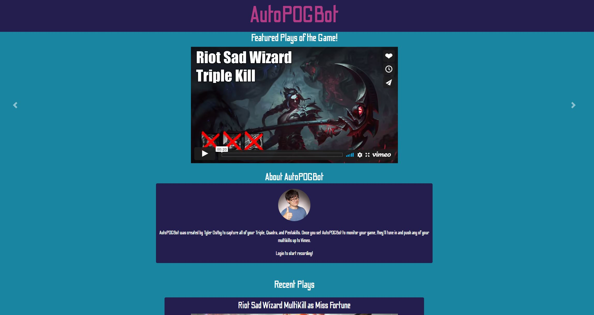

# Responsive-Portfolio

## Project Description

I created a React web application that displays plays of the game from a League of Legends bot called AutoPOGBot. Users are able to see recent plays of the game recorded to vimeo. 

## Table of Contents
1. [Installation](#installation)
2. [Usage](#usage)
3. [License](#license)
4. [Questions](#questions)
5. [Credits](#credits)

## Installation
[Deployed Link](https://mikecoletta.github.io/autopogbotsite/)

## Usage

## License
    
MIT License
    
Copyright (c) 2021 Mike Coletta
          
## Questions?
    
[Github](https://github.com/MikeColetta)
    
For any questions, please send me an [email](mailto:coletta.mike@gmail.com).